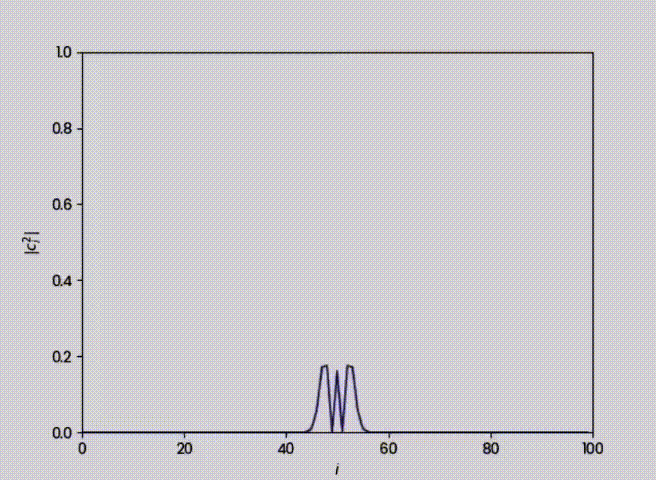

# Planeamiento  y Resultados 

En esta sección se mostraran el planteamiento y los resultados obtenidos de MODELO DE TIGHT BINDING DE OCUPACIÓN SIMPLE CON POTENCIAL DEFINIDO: DINÁMICA.    

## Las dos metodologías que son mejores para implementar la solución numérica.

####  Método de Runge-Kutta 2  Orden (RK2)

> **Nota:** La idea del método RK2 es utilizar el punto medio para evaluar el método de Euler.

#### Método de Runge-Kutta de 4 Orden
> **Nota:** Mejor compromiso entre complejidad y error de aproximación. Este método es el más utilizado comúnmente para resolver ODEs.

## Visualizar su dinámica

## Paralelización 
En el grafico presenado a coninuacion vamos a observar la

